# IDKEngine

Feature list:
 - Wavefront Path Tracer with Ray Sorting and [OIDN](https://github.com/RenderKit/oidn)
 - High Quality SweepSAH BVH with PreSplitting + GPU Refitting
 - Real-Time Voxel Global Illumination
 - [AMD FSR2](https://github.com/JuanDiegoMontoya/FidelityFX-FSR2-OpenGL) and Temporal Anti Aliasing
 - Mesh Shaders + Multi Draw Indirect + Bindless Textures + lots of OpenGL...
 - glTF support including animations and various extensions
 - Custom Collision Detection against triangle meshes
 - CoD-Modern-Warfare Bloom
 - Ray Traced Shadows
 - Variable Rate Shading
 - Order Independent Transparency
 - Ray marched Volumetric Lighting
 - GPU Frustum + Hi-Z Culling
 - Screen Space Reflections
 - Screen Space Ambient Occlusion
 - Atmospheric Scattering
 - Asynchronous texture loading
 - Camera capture and playback with video output

Required OpenGL: 4.6 + `ARB_bindless_texture` + `EXT_shader_image_load_formatted` + `KHR_shader_subgroup` + any of (`ARB_shader_viewport_layer_array`, `AMD_vertex_shader_layer`, `NV_viewport_array2`)

Notes:
 * If [OIDN](https://github.com/RenderKit/oidn) is found in PATH or near the executable you are given the option to denoise path traced images
 * If [gltfpack](https://github.com/BoyBaykiller/meshoptimizer) is found in PATH or near the executable you are given the option to compress glTF files on load
 * Doesn't work on Mesa radeonsi or Intel driver
 * I no longer have access to a NVIDIA GPU, so I can't guarantee NVIDIA exclusive features work at any given point


# Controls
| Key                   | Action                        | 
|-----------------------|-------------------------------| 
|  W, A, S, D           | Move                          |
|  Space                | Move Up                       |
|  Shift                | Move faster                   |
|  E                    | Enter/Leave GUI Controls      |
|  T                    | Resume/Stop Time              |
|  R-Click in GUI       | Select Object                 |
|  R-Click in FPS Cam   | Shoot Shadow-Casting Light    |
|  Control + R          | Toogle Recording              |
|  Control + Space      | Toogle Replay                 |
|  G                    | Toggle GUI visibility         |
|  V                    | Toggle VSync                  |
|  F11                  | Toggle Fullscreen             |
|  ESC                  | Exit                          |
|  1                    | Recompile all shaders         |

# Path Traced Render Samples


## Voxel Global Illumination

### 1.0. Overview

VXGI (or Voxel Cone Tracing) is a global illumination technique developed by NVIDIA, originally [published](https://research.nvidia.com/sites/default/files/publications/GIVoxels-pg2011-authors.pdf) in 2011. Later when the Maxwell architecture (GTX-900 series) released, the implementation was improved using GPU specific features starting from that generation. I'll show how to use those in a bit.

The basic idea of VXGI is:
1. Voxelize the scene
2. Cone Trace voxelized scene for second bounce lighting

The voxelized representation is an approximation of the actual scene and Cone Tracing is an approximation of actual Ray Tracing.
Trading accuracy for speed! Still, VXGI has the potential to naturally account for various lighting effects. Here is a [video](https://youtu.be/5m9fOVWaqdE) showcasing some of them.
I think it's a great technique to implement in a hobby renderer, since it's conceptually easy to understand, gives decent results and you get to play with advanced OpenGL features!

### 2.0 Voxelization

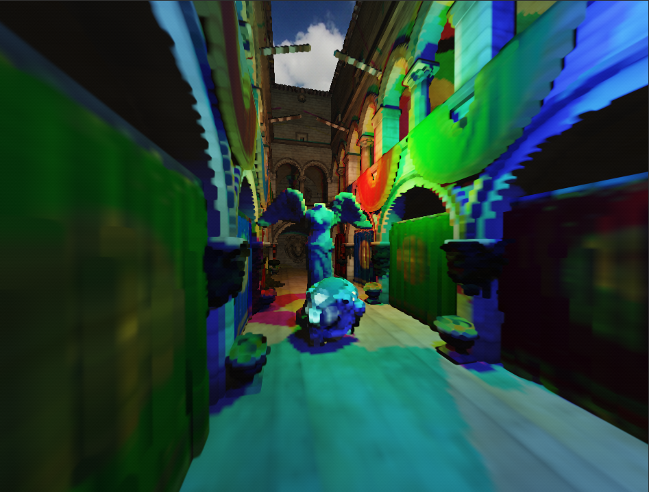

This is a visualization of a 384-sized `rgba16f`-format 3D texture. It's the output of the voxelization stage. Every pixel/voxel is shaded normally using some basic lighting and classic shadow maps. I only have this single texture, but others might store additional information such as normals for multiple bounces. The voxelization happens using a single shader program. A basic vertex shader and a rather unusal but clever fragment shader.

#### Vertex Shader
There are two variables `vec3: GridMin, GridMax`.
Those define the world space region which the voxel grid spans over. When rendering, triangles get transformed to world space like normally and then mapped from the range `[GridMin, GridMax]` to `[-1, 1]` (normalized device coordinates).
Triangles outside the grid will not be voxelized.
As the grid grows, voxel resolution decreases. 

```glsl
#version 460 core
layout(location = 0) in vec3 Position;

uniform vec3 GridMin, GridMax;
out vec3 NormalizedDeviceCoords;

void main() {
    vec3 fragPos = (ModelMatrix * vec4(Position, 1.0)).xyz;

    // transform fragPos from [GridMin, GridMax] to [-1, 1]
    NormalizedDeviceCoords = MapToNdc(fragPos, GridMin, GridMax);

    gl_Position = vec4(NormalizedDeviceCoords, 1.0);
}

vec3 MapToNdc(vec3 value, vec3 rangeMin, vec3 rangeMax) {
    return ((value - rangeMin) / (rangeMax - rangeMin)) * 2.0 - 1.0;
}
```

#### Fragment Shader

We won't have any color attachments. In fact there is no FBO at all.
We will write into the 3D texture manually using OpenGL [image store](https://www.khronos.org/opengl/wiki/Image_Load_Store).
Framebuffers are avoided because you can only ever attach a single texture-layer for rendering.
Image store works on absolute integer coordinates, so to find the corresponding voxel position we can transform the normalized device coordinates.

```glsl
#version 460 core
layout(binding = 0, rgba16f) restrict uniform image3D ImgVoxels;

in vec3 NormalizedDeviceCoords;

void main()  {
    vec3 uvw = NormalizedDeviceCoords * 0.5 + 0.5; // transform from [-1, 1] to [0, 1]
    ivec3 voxelPos = ivec3(uvw * imageSize(ImgVoxels)); // transform from [0, 1] to [0, imageSize() - 1]

    vec3 voxelColor = ...; // compute some basic lighting
    imageStore(ImgVoxels, voxelPos, vec4(voxelColor, 1.0));
}
```

---

Since we don't have any color or depth attachments we want to use an [empty framebuffer](https://www.khronos.org/opengl/wiki/Framebuffer_Object#Empty_framebuffers). It's used to explicitly communicate OpenGL the render width & height, which normally is derived from the color attachments. To not miss triangles, face culling is off. Color and other writes are turned off implicitly by using the empty framebuffer. Clearing is done by a simple compute shader.

Now, running the voxelization as described so far gives me this. There are two obvious issues that I'll address.


### 2.1 Fixing flickering

Flickering happens because the world space position for different fragment shader invocations can get mapped to the same voxel, and the invocation that writes to the image at last is random. One decent solution is to store the `max()` of the already stored and the new voxel color. There are several ways to implement this in a thread-safe manner: Fragment Shader Interlock, CAS-Loop, Atomic Operations.
Fragment Shader Interlock is not in OpenGL Core and generally slower (certainly on AMD). CAS-Loop is what I've seen the most but it's unstable and slow.
So I decided to go with Atomic Operations, `imageAtomicMax` in particular.

```glsl
layout(binding = 0, r32ui) restrict uniform uimage3D ImgVoxelsR;
layout(binding = 1, r32ui) restrict uniform uimage3D ImgVoxelsG;
layout(binding = 2, r32ui) restrict uniform uimage3D ImgVoxelsB;

void main() {
    uvec3 uintVoxelColor = floatBitsToUint(voxelColor);
    imageAtomicMax(ImgVoxelsR, voxelPos, uintVoxelColor.r);
    imageAtomicMax(ImgVoxelsG, voxelPos, uintVoxelColor.g);
    imageAtomicMax(ImgVoxelsB, voxelPos, uintVoxelColor.b);
}
```

Image atomics can only be performed on single channel integer formats, but the voxel texture is required to be at least `rgba16f`. So I create three additional `r32ui`-format intermediate textures to perform the atomic operations on. If you have Alpha it's best to premultiply it here. After voxelization, in a simple compute shader, they get merged into the final `rgba16f` texture.

### 2.2 Fixing missing voxels

Why are there so many missing voxels? Consider the floor. What do we see if we view it from the side.

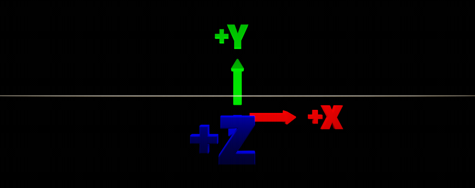

Well, there is a thin line, but technically even that shouldn't be visible. When this gets rasterized the [voxelization fragment shader](#fragment-shader) won't even run.
The camera should have been looking along the Y axis, not Z, because this is the dominant axis that maximizes the amount of projected area (more fragment shader invocations). The [voxelization vertex shader](#vertex-shader) doesn't have a view matrix and adding one would be overkill. To make the "camera" look a certain axis we can simply swizzle the vertex positions.

This is typically implemented in a geometry shader by finding the dominant axis of the triangle's geometric normal and then swizzling the vertex positions accordingly. Geometry shaders are known to be very slow, so I went with a different approach.

```glsl
uniform int RenderAxis; // Set to 0, 1, 2 for each draw

void main() {
    gl_Position = vec4(NormalizedDeviceCoords, 1.0);

    if (RenderAxis == 0) gl_Position = gl_Position.zyxw;
    if (RenderAxis == 1) gl_Position = gl_Position.xzyw;
}
```

The entire scene simply gets rendered 3 times, once from each axis. No geometry shader is used. This works great together with `imageAtomicMax` from [2.2 Fixing missing voxels](#22-fixing-missing-voxels), since the fragment shader doesn't just overwrite a voxel's color each draw.

Performance comparison on 11 million triangles [Intel Sponza](https://www.intel.com/content/www/us/en/developer/topic-technology/graphics-research/samples.html) scene with AMD RX 5700 XT, only measuring the actual voxelization program:

* 5.3 ms without geometry shader (rendering thrice method)
* 10.5 ms with geometry shader (rendering once method)

The rendering thrice method is simpler to implement and faster. Still it's far from optimal. For example swizzling the vertices in a compute shader and then rendering only once, basically emulating the geometry shader, would likely be more performant.

### 3.0 Optimizations (using NV-extensions)

There are certain extensions we can use to improve the voxelization process. These are only supported on NVIDIA GPUs starting from the Maxwell architecture (GTX-900 series).

#### GL_NV_shader_atomic_fp16_vector
This extensions is used to improve the implementation discussed in [2.1 Fixing flickering](#21-fixing-flickering).

It allows to perform atomics on `rgba16f`-format images. This means the three `r32ui`-format intermediate textures and the compute shader that merges them into the final voxel texture are no longer needed. Instead we can directly perform `imageAtomicMax` on the voxel texture.

```glsl
#version 460 core
#extension GL_NV_shader_atomic_fp16_vector : require
layout(binding = 0, rgba16f) restrict uniform image3D ImgVoxels;

void main() {
    imageAtomicMax(ImgResult, voxelPos, f16vec4(voxelColor, 1.0));
}
```

#### GL_NV_geometry_shader_passthrough + GL_NV_viewport_swizzle
These extensions are used to improve the implementation discussed in [2.2 Fixing missing voxels](#22-fixing-missing-voxels)

What if the geometry shader wasn't painfully slow? Then we could actually use it instead of rendering the scene 3 times.
Fortunately, `GL_NV_geometry_shader_passthrough` allows exactly that. The extension limits the abilities of normal geometry shaders, but it lets the hardware implement them with minimal overhead. One limitation is that you can no longer modify vertex positions of the primitive. So how are we going to do per vertex swizzling then? With `GL_NV_viewport_swizzle`. The extension allows associating a swizzle with a viewport.
```glsl
#version 460 core
#extension GL_NV_geometry_shader_passthrough : require

layout(triangles) in;
layout(passthrough) in gl_PerVertex {
    vec4 gl_Position;
} gl_in[];

layout(passthrough) in InOutData {
    // in & out variables...
} inData[];

void main() {
    vec3 p1 = gl_in[1].gl_Position.xyz - gl_in[0].gl_Position.xyz;
    vec3 p2 = gl_in[2].gl_Position.xyz - gl_in[0].gl_Position.xyz;
    vec3 normalWeights = abs(cross(p1, p2));

    int dominantAxis = normalWeights.y > normalWeights.x ? 1 : 0;
    dominantAxis = normalWeights.z > normalWeights[dominantAxis] ? 2 : dominantAxis;

    // Swizzle is applied by selecting a viewport
    // This works using the GL_NV_viewport_swizzle extension
    gl_ViewportIndex = 2 - dominantAxis;
}
```

This is like a standard voxelization geometry shader. It finds the axis from which the triangle should be rendered to maximize projected area and then applies the swizzle accordingly. Except that the swizzle is applied indirectly using `GL_NV_viewport_swizzle` and the geometry shader is written using `GL_NV_geometry_shader_passthrough`. How to associate a particular swizzle with a viewport is an exercise left to the reader :)

---

Voxelization performance for 11 million triangles [Intel Sponza](https://www.intel.com/content/www/us/en/developer/topic-technology/graphics-research/samples.html) at 256^3 resolution, including texture clearing and (potential) merging. Even though the RTX 3050 Ti Laptop is a less powerful GPU we can make it voxelize faster and take up less memory in the process by using the extensions.

| GPU                  | Baseline       | FP16-Atomics(2.5x less memory)  | Passthrough-GS | FP16-Atomics(2.5x less memory) + Passthrough-GS |
|----------------------|----------------|---------------------------------|----------------|-------------------------------------------------|
| RTX 3050 Ti Laptop   | 19.05ms        | 17.60ms                         | 6.41ms         | 4.93ms                                          |
| RX 5700 XT           | 6.49ms         | not available                   | not available  | not available                                   |

### 3.0 Cone Tracing

TODO

## Good BVHs with SweepSAH

### 1.0 Overview

<p align="center">
  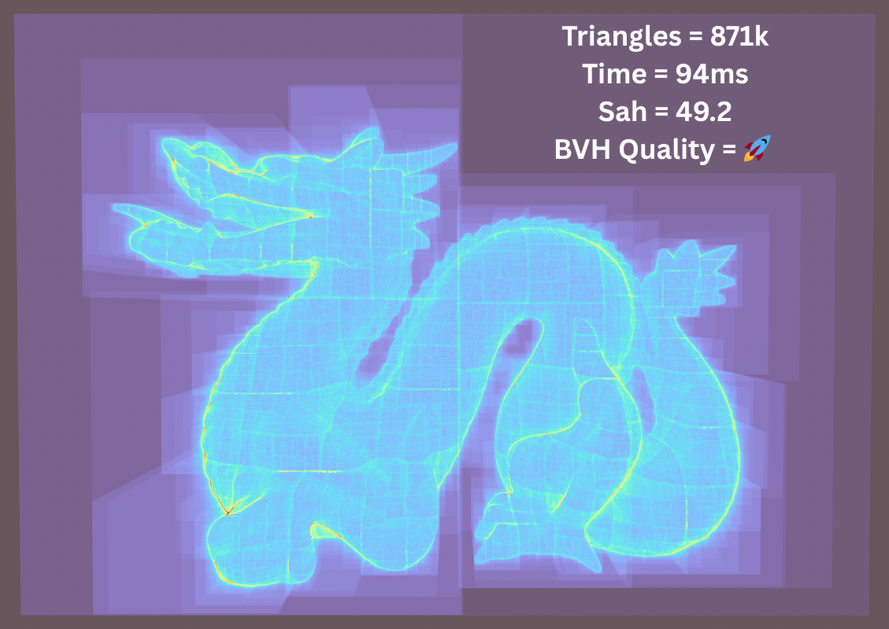<br>
  <em>Traversal heatmap of SweepSAH BVH for Stanford dragon</em>
</p>

SweepSAH is a method to find the optimal split position in top-down BVH builds. It produces better results than other methods such as SpatialMedianSplit, ObjectMedianSplit or BinnedSAH, because it evaluates all split positions. It can also be implemented in a surprisingly efficient manner, taking around the same time to build as BinnedSAH with N=16.

You might wonder: Isn't there an infinite number of split positions, how can we test all of them? While there is an infinite number of points in space the number of objects is finite. And BVHs are object splitting not space splitting.

Because BVHs are object spliting, we should not think of the split search process as finding a spatial position, but rather as finding a partitioning of the parent primitives. For $N$ primitives there are $2^{N - 1} - 1$ possible partitionings. As an example, here are all for **{A, C, E, J}**:

#### "Classic" partitions

1. **{A\} + \{C, E, J}**
2. **{A, C\} + \{E, J}**
3. **{A, C, E\} + \{J}**

#### "Exotic" partitions

4. **{A, E}** + **{C, J}**
5. **{A, J}** + **{C, E}**
6. **{C}** + **{A, E, J}**
7. **{E}** + **{A, C, J}**

Notice how the classic partitions can be created by defining a single split index that divides the primitives into two sets. "Split index" being the object space equivalent of split position. Unlike other methods, SweepSAH goes through all these $N - 1$ classic partitions and picks the one with the lowest cost. Here you can see it sweeping through the triangles on the x-axis, moving the split index one step further to the right every time. These correspond to the first three partitions I've listed: 

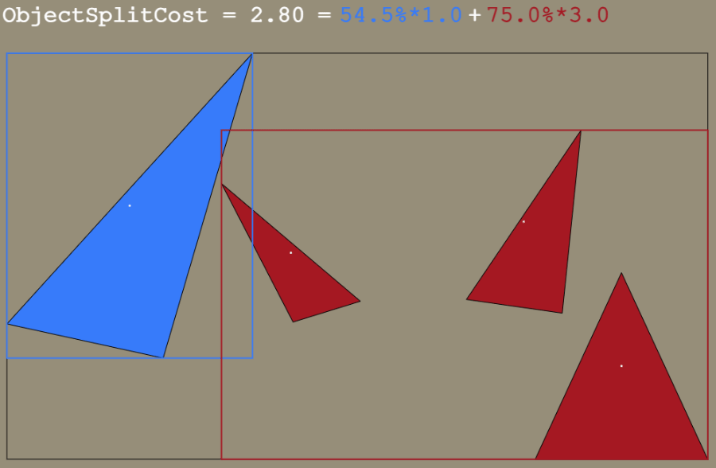

But what about the exotic partitions? Let's look at number 5 as an example. This corresponds to the far left and far right triangle forming a child. The two middle triangles form the other child. These kind of partitions are usually uninteresting. So as with other split methods, they are ignored. However, I do have a small extension that [tests some](#50-considering-exotic-partitions).

### 2.0 Implementation

As the name suggests, the Surface Area Heuristic (SAH) is used to estimate the cost of a split. During the split search we can use this simplified model:
```cs
// Weigh primitive count by area of enclosing box 
float leftCost = leftBox.Area() * leftPrimCount;
float rightCost = rightBox.Area() * rightPrimCount; 

float cost = leftCost + rightCost;
```
I've excluded the fixed traversal/triangle cost and normalization by parent area here because these components only scale both sides by the same amount. We can worry about them later.

As you can see the SAH requires us to know the bounding box and count of all primitives which are left and right to a split index. We have $N-1$ split indexes. And for each potential split we have $N$ primitives to check. That sounds like a painfully slow $O(N^2)$ algorithm. But it can actually be reduced to $O(N)$!

Imagine for a moment that the primitives are sorted by their position on the axis of interest. `start` and `end` denote the primitive range of the parent node:
```
Sort(start, end, primitives, (box) => box.Center()[axis]);
```

> [!NOTE]
> My BVH builder uses bounding boxes as primitives. The user has to create them from the triangles. This keeps the build process primitive agnostic, supports spatial splits, and speeds up some operations. I’ve also seen better trees from sorting by box centers and overall recommend it. But triangle centroids will work too

Then let us iterate through all splits like this and ask: "What are the primitives left and right to the current split position?"
```cs
for (int i = start; i < end - 1; i++)
{
    int splitIndex = i + 1;
    Box primitive = primitives[splitIndex];
    float splitPos = primitive.Center()[axis];

    // find all primitives left & right to splitPos
}
```
Because the primitives are now sorted, we can easily answer this question. All left primitives must be before the current index `i` (and let's include `i` itself too), with the right ones following afterwards. This means every iteration the current primitive must be added to the left side. This insight removes the need for an inner loop to find all left triangles. We can just accumulate the left side as we sweep:

```cs
Box leftBoxAccum = Box.Empty();
int leftCounter = 0;

// Sweep over primitives from left to right
for (int i = start; i < end - 1; i++)
{
    // Update left side to include the new primitive
    leftCounter++; // equal to `splitIndex - start`
    leftBoxAccum.Grow(primitives[i]);

    // Compute split cost
    float leftCost = leftBoxAccum.Area() * leftCounter;
    float rightCost = ???; // missing

    float cost = leftCost + rightCost;
}
```
I've also added the cost calculation here. As you can see, we already have enough information to compute `leftCost` of the current split. However, we're still missing `rightCost`. To get that we can apply the same concept again. We perform an additional pass before this one that sweeps in reverse, from right to left. And we write out the right costs for later use:

```cs
// Reverse sweep to gather rightCost values
Box rightBoxAccum = Box.Empty();
int rightCounter = 0;
for (int i = end - 1; i >= start + 1; i--)
{
    rightCounter++;
    rightBoxAccum.Grow(primitives[i]);

    float rightCost = rightBoxAccum.Area() * rightCounter;
    RightCosts[i] = rightCost;
}
```
In order to store the right costs we need to allocate a float array before the recursion begins.
From now on, I will represent all temporary build data in this struct:
```diff
struct BuildData
{
+   float RightCosts[primCount];
}
```


With that, we can fetch the missing `rightCost` and compute the total cost during the left-right sweep:
```cs
// Compute split cost
float leftCost = leftBoxAccum.Area() * leftCounter;
float rightCost = RightCosts[i + 1];
float cost = leftCost + rightCost;
```

The split with the lowest cost should be recorded into an object `bestSplit`.

To summarize:

1. Sort the primitives by their position on the current axis
2. Sweep from right to left to get `rightCost`s and temporarily store them
3. Sweep from left to right to get `leftCost` and add it to the fetched `rightCost` to get the total cost

If you have already implemented BinnedSAH, steps 2 and 3 may be familiar to you. The difference is that we sweep over primitives rather than bins.

---

Once the search for the lowest-cost object split across all axes is complete, there are two more things to do.

As a reminder, I've hoisted some components from the SAH calculation during sweeping as they are not needed at that stage. Now is a good place to update it with the missing `TRAVERSAL_COST`, `TRIANGLE_COST` and normalization by `parentArea` to get the proper SAH.
```cs
bestSplit.Cost = TRAVERSAL_COST + (TRIANGLE_COST * bestSplit.Cost / parentArea);
```

Lastly, there is one important step. Unless splitting of the subtree is aborted because some threshold is reached, we still need to actually put the triangles into the best partition. To do this, just sort one more time on the best axis:
```cs
Sort(start, end, primitives, (box) => box.Center()[bestSplit.Axis]);
```

In theory, a partial sort ([`std::partial_sort`](https://en.cppreference.com/w/cpp/algorithm/partial_sort.html)) would suffice here, but I'll show how to remove all sorts during recursion in the next chapter anyway!

### 2.1 Running in O(N)

The implementation described so far is functional but requires four sorts per recursion. Once per axis and one more to partition the primitives. As it turns out, this can be algorithmically improved: It's enough to globally sort only once per axis before recursion starts and use a fast stable partition ([`std::stable_partition`](https://en.cppreference.com/w/cpp/algorithm/stable_partition.html)) during recursion to keep things correct. This provides a significant reduction in build time. This insight comes from [Bonsai: Rapid Bounding Volume Hierarchy
Generation using Mini Trees](https://jcgt.org/published/0004/03/02/paper-lowres.pdf).

The algorithm maintains three primitive indices arrays, one per axis. It's a good idea to use indices instead of actual primitives to save memory.
```diff
struct BuildData
{
    float RightCosts[primCount];
+   int PrimIndicesSorted[primCount][3];
}
```

Each array is initialized with increasing numbers to reference the primitives. Then the indices get sorted by their primitive position along the axis - as required by SweepSAH. 
```cs
for (int axis = 0; axis < 3; axis++)
{
    // Allocate primitive indices
    PrimIndicesSorted[axis] = new int[primCount];

    // Let each index reference a primitive
    FillIncreasing(PrimIndicesSorted[axis]);

    // Then sort them based on the position on the axis
    Sort(PrimIndicesSorted[axis], (id) => primitives[id].Center()[axis]);
}
```
With that, primitives are accessed as follows during SweepSAH:
```
Span<int> indices = PrimIndicesSorted[axis];
Box primitive = primitives[indices[i]];
```
`indices` is already sorted, so the `Sort` procedure which I mentioned in the [initial implementation](#20-implementation) that happens during recursion can be removed.

After SweepSAH has found the best split, we need to do some work to correctly partition the arrays. This lies at the heart of the algorithm. Let's look at an example. Here, I've listed the parent "primitives" sorted by the x-, y- and z-axis respectively. SweepSAH has found the best split to be on the x-axis at `splitIndex=2`.
```
x: [A, C, E, J];  y: [J, C, E, A];  z: [C, E, A, J]
         ^
        / \
  [A, C] + [E, J]
```
That makes the set of left primitives {A, C} and right {E, J}. The goal is for all three arrays to contain the same primitives left and right to the `splitIndex` and to be sorted within each set. The x-array on which we split, is naturally partitioned that way. However, for the y- and z-array, the left primitives, {A, C}, still need to be moved before the right ones. And that while preserving relative order. This is achieved using a stable partition.
Below are the new y- and z- subsets:
```
y => [C, A] + [J, E]
z => [C, A] + [E, J]
```
Since the initial parent primitives were sorted and the partitioning is stable (i.e. it preserves the relative order) the new child sets are also sorted. For example, in the initial y-array `J` was ordered before `E` and as you can see this is still the case.

In code, we need to mark all primitives as being on the left/right side. For that we add a bool array:
```diff
struct BuildData
{
    float RightCosts[primCount];
    int PrimIndicesSorted[primCount][3];
+   bool PartitionLeft[primCount];
}
```

All left primitive indices are flagged as `true` and right `false`. When we `StablePartition` the other two primitive indices array it will move all elements for which `PartitionLeft[input[i]]` is `true` first, in order:
```cs
// Mark on which side primitive references are
for (int i = start; i < bestSplit.SplitIndex; i++)
{
    PartitionLeft[PrimIndicesSorted[bestSplit.Axis][i]] = true;
}
for (int i = bestSplit.SplitIndex; i < end; i++)
{
    PartitionLeft[PrimIndicesSorted[bestSplit.Axis][i]] = false;
}

// For the other axes, move the left primitives before the right ones, while preserving relative order
StablePartition(PrimIndicesSorted[(bestSplit.Axis + 1) % 3].Slice(start, end), PartitionLeft);
StablePartition(PrimIndicesSorted[(bestSplit.Axis + 2) % 3].Slice(start, end), PartitionLeft);
```

Once the BVH has been built, you can use any of the three primitive indices arrays for traversal, etc.

### 3.0 Optimizations

There are many optimizations that can be made to further reduce the build time. I will quickly describe some opts I implemented.

#### Early out

The cost always increases in one direction. So in the right-to-left sweep when `rightCost >= bestSplit.Cost`, I save the last index into `firstRight` and break out of the loop early. The following left-to-right sweeps starts from `firstRight` instead of `start`. This culls triangles on the left. Similarly, for the left-to-right sweep triangles can be culled on the right: When `leftCost >= bestSplit.Cost`, break.

#### Alloc free stable partition

A O(N) stable partition needs to allocate a temporary buffer of `N` items. We already have a large enough temporary buffer: `RightCosts`. At this point the cost values are no longer needed so it's fine to trash them. I implemented my own stable partition that reuses this buffer, avoiding extra allocations.

#### Codegen

The box is padded to 16 bytes for efficient vectorization using SSE instructions. 
The `Grow` procedure is accelerated with vector min & max (`vminps` + `vmaxps`). For `HalfArea()`, a vector subtract (`vsubps`) gets the size on all dimensions and fused multiply-add (`vfmadd231ss`) is used to get the area. Methods are all inlined.

#### Sorting

A three pass LSB Radix Sort is used for the initial sorting on all axes. This almost halves the total build time for 262k triangles Sponza compared to using the built-in comparison-based sort.
When computing the centers, the multiplication by 0.5 is omitted.

#### Multithreading

Two places are multithreaded. First, during the initial sort, all three axes are processed in parallel. Second, and more importantly, the actual recursion is also threaded. When the triangle count of both subtrees is above a threshold one of them is processed in a new thread:
```cpp
std::thread t(Build(leftNodeId, rightNodeId + 1)); // left
Build(rightNodeId, rightNodeId + (2 * newLeftNode.TriCount - 1)); // right

t.Join();
```
The new node offset for the right subtree is obtained using simple arithmetic, assuming the left subtree is built with 1 primitive per leaf.
Since I am not actually building with 1PPL, but rather terminating based on SAH, this leads to empty subtrees at the bottom.
So the BVH is compacted in-place after the recursion completed with a simple depth-first traversal that writes out all visited nodes and adjusts the parent link to child. This more than halves build time.

### 4.0 Results

A small set of data to compare against:

| Scene (triangles) | Build | SAH  |
|---------|-----|------|
| Sponza (262k) | 30ms | 76.6 |
| Stanford Dragon (871k) | 92ms | 49.2 |
| Bistro (2.8m) | 409ms | 88.4 |
| San Miguel (5.6m) | 1118ms | 62.6 |

I used `TRAVERSAL_COST=1.0` and `settings.TriangleCost=1.1` and I forced a maximum primitive count of 8 per leaf. Results were produced with Ryzen 7 5700X3D on commit [`e7ff348`](https://github.com/BoyBaykiller/IDKEngine/tree/e7ff3487a417b40145b9763c3705607d06548e1d).

To compute the global SAH cost of a BVH you can use the following: 

```cs
float rootArea = blas.Nodes[0].HalfArea();
for (int i = 0; i < blas.Nodes.Length; i++)
{
    GpuBlasNode node = blas.Nodes[i];
    float probHitNode = node.HalfArea() / rootArea;

    if (node.IsLeaf)
    {
        cost += settings.TriangleCost * node.TriCount * probHitNode;
    }
    else
    {
        cost += TRAVERSAL_COST * probHitNode;
    }
}
```


### 5.0 Considering exotic partitions

TODO

## Better BVHs with PreSplitting

### 1.0 Overview

<p align="center">
  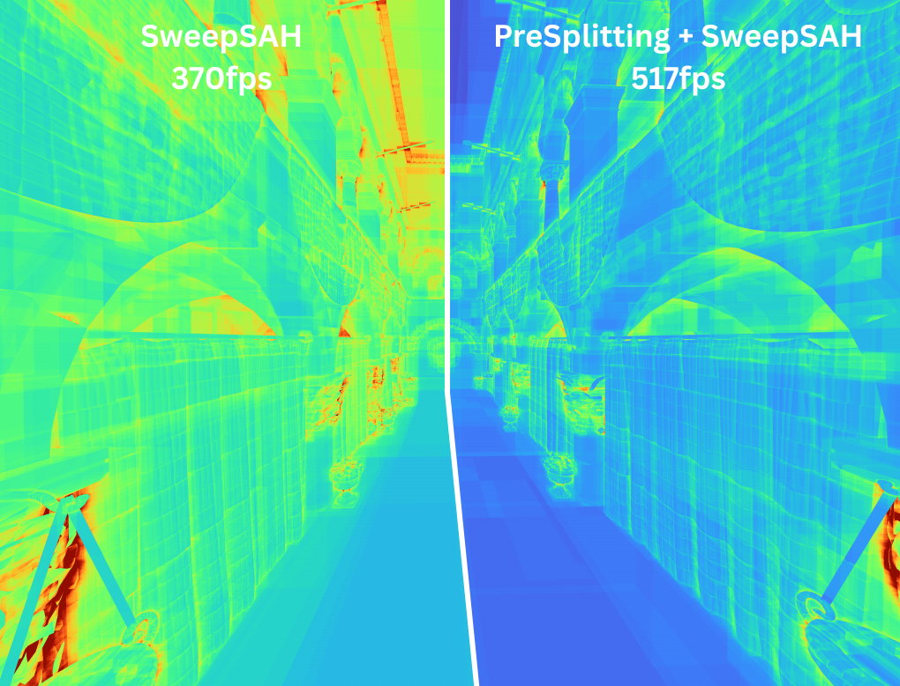<br>
  <em>Traversal heatmap of SweepSAH and PreSplitting + SweepSAH showing a 40% improvement</em>
</p>

Traditionally, BVHs are purely object splitting. While object splits have their advantages they struggle with long triangles and non axis-aligned geometry. For such cases we want to be able to do spatial splits. PreSplitting is a simple and effective way to add spatial splits to any BVH without even needing to touch the building code. That's because it only splits the input primitives. Every split results in two new primitives so we actually feed the builder more primitives than the original mesh contains, yet "somehow" this is an improvement.

An object split splits the primitive array into two sides using a **split index** which may result in overlap. A spatial split on the other hand splits space itself using a **split plane** and primitives which straddle the split plane are split into two new ones. Spatial splits never cause overlap but come at an increased memory cost:

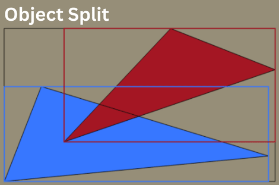

An other way to consider spatial splits is not as a pre-process but during the build. This is called [SBVH](https://www.nvidia.in/docs/IO/77714/sbvh.pdf) which is typically regarded as the highest quality builder. During construction, it finds the best object and spatial split and always picks the one with lower cost. It makes a more informed decision as to when and where to do a spatial split and finds lower global SAH costs.

Having implemented both, I prefer PreSplitting over SBVH. Performance is very similar in practice and it's easier to code, adds less time to the build process and works with all build methods. Depending on the scene you can expect a ~1.2x traversal performance increase and even ~3x in extreme cases (see [Results](#40-results-1)). In my experience you get the most out of it when combined with a high quality top-down builder like [SweepSAH](#good-bvhs-with-sweepsah). Despite it's usefulness, this PreSplitting technique seems unknown and I am hoping to change that. If you're looking for references I can link the [paper](https://research.nvidia.com/sites/default/files/pubs/2013-07_Fast-Parallel-Construction/karras2013hpg_paper.pdf) and the [accompanying slides](https://www.highperformancegraphics.org/wp-content/uploads/2013/Karras-BVH.pdf) (slide 53). I also want to thank madmann for [his implementation](https://github.com/madmann91/bvh/blob/2fd0db62022993963a7343669275647cb073e19a/include/bvh/heuristic_primitive_splitter.hpp).

### 2.0 Implementation

First of all, to give you a better picture, this is how PreSplitting is integrated at a high level:
```cs
(Box[] primitives, int[] origTriangleIds) = PreSplit(triangles, splitFactor);
Node[] nodes = BuildBVH(primitives);
Triangle[] bvhTriangles = GetUnindexedTriangles(nodes, triangles, origTriangleIds); // optional
```
`PreSplit` takes in the mesh's triangles and returns two arrays of equal length. Together these may be called "Fragments", a term coined by a [paper](https://diglib.eg.org/items/f55715b1-9e56-4b40-af73-59d3dfba9fe7) about the aforementioned SBVH. `splitFactor` determines how many additional fragments are allowed. I use a value of 0.3 so a maximum 30% increase. The resulting `primitives` are then passed to `BuildBVH`. After the BVH is build, `GetUnindexedTriangles` removes the `origTriangleIds` indirection and outputs a new larger array of triangles. It can also do triangle deduplication.

As you can see the new `primitives` returned are of type `Box`. **If you haven't already, you need to adjust your BVH builder to work on boxes and not triangles.** This may sound complex, but it's easily done and the better thing to do anyway. Instead of triangle centroids use box centers. And instead of recomputing the triangle bounds every time just use the given box bounds. This will not only lower build time and tend to give better trees but more importantly make it PreSplitting compatible. When PreSplitting is disabled (or not yet implemented) just feed it a box per triangle. This is equivalent to PreSplitting with `splitFactor = 0.0`:
```cs
Box[] primitives = new Box[triangles.Length];
for (int i = 0; i < triangles.Length; i++)
{
    primitives[i] = Box.From(triangles[i]);
}
BuildBVH(primitives);
```

---

The next three chapters discuss core parts of the `PreSplit` algorithm. Please be encouraged to follow along in the [source code](https://github.com/BoyBaykiller/IDKEngine/blob/b2e9c3e3e2f3098a1e907ccbb349f18b49dee7ce/IDKEngine/Source/Bvh/PreSplitting.cs#L26-L110). They are in the same order.

### 2.1 Determining Split Count

Not all triangles need to be split. And some may need to be split many times. We want a heuristic that determines how "problematic" any given triangle is. We use this function:

```cs
float Priority(Triangle triangle)
{
    Box triBox = Box.From(triangle);

    // Extent^2 to concentrate more splits on large triangles
    float extentPrio = triBox.LargestExtent() * triBox.LargestExtent();
    float emptyAreaPrio = triBox.Area() - triangle.Area;

    // Cbrt to more evenly distribute among triangles
    return MathF.Cbrt(extentPrio * emptyAreaPrio);
}
```
This prioritizes large triangles whos bounding box contains lots of empty space. The empty space term is specifically for rotated geometry, because AABBs (unlike OOBs) tend to be a poor fit for rotated geometry causing empty space. It's possible that a BVH using OBBs would not require this term.

Priority alone doesn't tell the full story. 
If all triangles are "large" then none of them are. What I mean is that split count should be defined in a relative manner. Previous methods would just compare some notion of priority against a threshold like the global scene area to a determine a split count. But we can do better:

```cs
int GetSplitCount(float priority, float totalPriority, int triangleCount)
{
    float shareOfTris = priority / totalPriority * triangleCount;
    int splitCount = 1 + (int)(shareOfTris * settings.SplitFactor);

    return splitCount;
}
```
The split count of any triangle is computed based on what percentage of `totalPriority` it takes. If all triangles have the same priority and the user chosen `splitFactor` is less than 1.0, no splits are made. It kind of reminds me of mathematical variance. At the end 1 is added. `splitCount = 1` is the minimum value and interpreted as simply returning the unmodified triangle box.

With that we can get the summed split count of all triangles so that we can allocate appropriately sized arrays:

```cs
float totalPriority = 0.0f;
for (int i = 0; i < geometry.TriangleCount; i++)
{
    Triangle triangle = geometry.GetTriangle(i);
    totalPriority += Priority(triangle);
}

int counter = 0;
for (int i = 0; i < geometry.TriangleCount; i++)
{
    Triangle triangle = geometry.GetTriangle(i);
    float priority = Priority(triangle);
    int splitCount = GetSplitCount(priority, totalPriority, geometry.TriangleCount);

    counter += splitCount;
}

Box[] bounds = new Box[counter];
int[] originalTriIds = new int[counter];
```

---

Presumably, (object splitting) BVHs struggle with triangles for which the shown `Priority` function returns a **relatively** large value, but why is that? Let's look at a real-life example. A scene I expect you to be all too familiar with. Sponza:

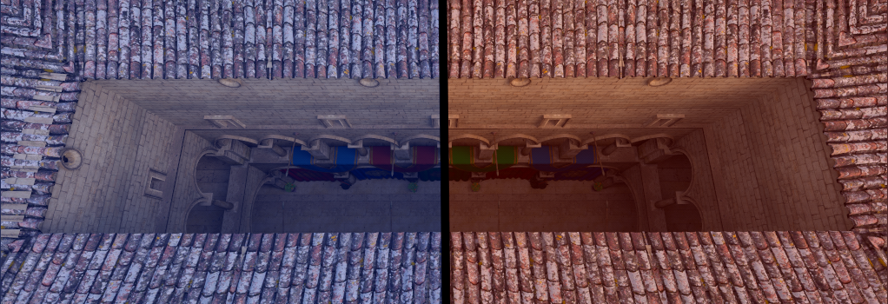

Sponza is symmetrical and largest on the x-axis so we'd expect the best split to be on the x-axis somewhere in the middle resulting in two bounding boxes as shown above. There is just one problem:

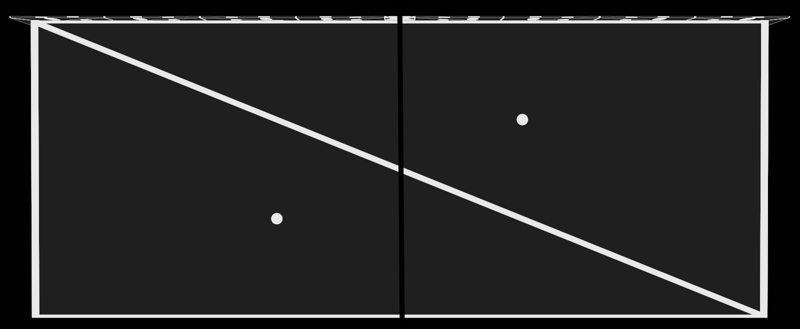

These large triangles that make up the walls and floor. They ruin our object split by causing the bounding boxes on both sides to cover the entire scene and heavily overlap. Spatial splits fix this by splitting the primitives at the split plane and eliminating overlap as shown in [Overview](#10-overview-2). In this case the triangles are perfectly axis-aligned, but splitting also provides a way to more accurately represent non axis-aligned triangles. Meaning less empty space and reduced number of ray-triangle tests.

I invite you to check in your own BVH code where the root node is split on Sponza. I also have [graphs](https://github.com/jbikker/tinybvh/issues/197#issuecomment-3216190572) showing the SAH costs for all splits on the x-axis before and after PreSplitting, if you're interested.

### 2.2 Determining Split Axis and Position

As we know, PreSplitting happens before BVH construction so we have limited information. The straightforward approach is to simply split each triangle on it's largest axis at the middle. This is what [ESC](https://web.archive.org/web/20240901180909/https://citeseerx.ist.psu.edu/document?repid=rep1&type=pdf&doi=ddfac027fa516d63fa705c52155ea9313543cf3a) does, an older technique. We also split on the largest axis, but we can improve upon the split position. To minimize overlap we should split many triangles at the same position. So instead of locally choosing a split plane solely based on the triangle we define global split planes that are shared by all triangles. The global split planes are defined by recursive spatial median splits of the scene's bounding box, like this: 

<p align="center">
  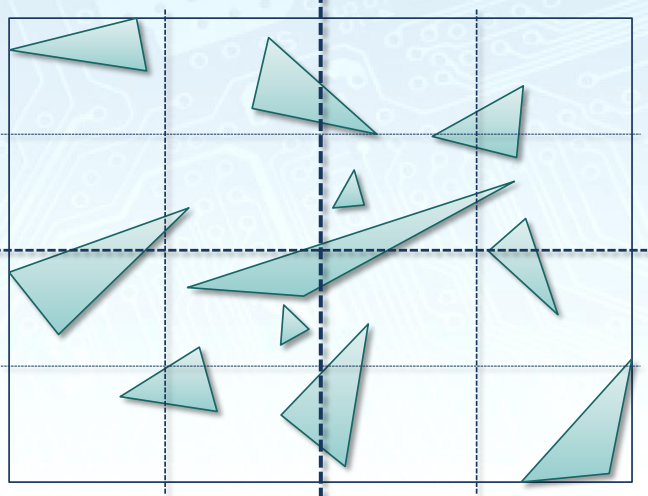<br>
  <em>Split Planes of a scene used by PreSplitting, slide 64</em>
</p>

Let the scene extents be normalized to range [0.0, 1.0]. We know,
* first level split divides space into 0.5-sized nodes
* second level split divides space into 0.25-sized nodes
* third level split divides space into 0.125-sized nodes
* ...

Now, let's say the normalized largest extent of a triangle is 0.6, named `alpha`. That means it must straddle the first level split plane because it can't fit into the 0.5-sized node.
It also straddles lower level split planes, but we don't care about those. We only care about the largest node size that is still smaller than `alpha` which can be computed as follows:
```cs
int level = (int)MathF.Floor(MathF.Log2(alpha));
float size = MathF.Pow(2.0f, level);
```
This chain of operations happens to be equivalent to extracting the exponent bits of a IEEE-754 floating point number. So my final optimized implementation looks like this:
```cs
float GetNodeSize(float extent, float globalSize)
{
    // See slide 64 in https://www.highperformancegraphics.org/wp-content/uploads/2013/Karras-BVH.pdf
    // Split planes are defined by recursive spatial median splits of the scene box.
    // Here we find the largest node size that is still smaller than alpha.
    // For alpha between 0.5 and 1.0. level => -1, size => 0.5
    // For alpha between 0.25 and 0.5. level => -2, size => 0.25
    // For alpha between 0.125 and 0.25. level => -3, size => 0.125

    // Transform into [0.0, 1.0]
    float alpha = extent / globalSize;

    // This computes 2^(floor(log2(alpha)))
    uint exponentBits = Unsafe.BitCast<float, uint>(alpha) & (255u << 23);

    // Transform back into global space
    float size = Unsafe.BitCast<uint, float>(exponentBits) * globalSize;

    return size;
}
```

After we got the node size we can snap the triangle's box position to the nearest node edge. And that gives us the final split position:
```cs
int splitAxis = parentBox.LargestAxis();
float largestExtent = parentBox.LargestExtent();
float nodeSize = GetNodeSize(largestExtent, globalSize[splitAxis]);

// Snap mid position to nearest split plane (still inside parentBox)
float midPos = (parentBox.Min[splitAxis] + parentBox.Max[splitAxis]) * 0.5f;
float index = MathF.Round((midPos - globalBox.Min[splitAxis]) / nodeSize);
float splitPos = globalBox.Min[splitAxis] + index * nodeSize;
```

### 2.3 Splitting a Triangle

At the heart lies the process of splitting a triangle:

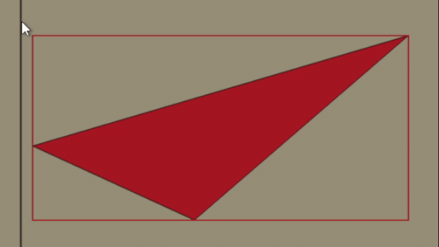

The previous chapters were already alluding to it: Splitting does in fact result in two bounding boxes, not triangles. This is done because it gives more freedom and results in no overlap (see figure 2 in "[Early Split Clipping](https://web.archive.org/web/20240901180909/https://citeseerx.ist.psu.edu/document?repid=rep1&type=pdf&doi=ddfac027fa516d63fa705c52155ea9313543cf3a)"). The actual implementation isn't too interesting, I just stole it from elsewhere and I suggest you do the same:
[`ValueTuple<Box, Box> Split(int axis, float position)`](https://github.com/BoyBaykiller/IDKEngine/blob/b2e9c3e3e2f3098a1e907ccbb349f18b49dee7ce/IDKEngine/Source/Shapes/Triangle.cs#L47-L92)

When splitting recursively we clip the resulting boxes against the parent box so that they remain within it:
```cs
(Box lBox, Box rBox) = triangle.Split(splitAxis, splitPos);
lBox.ClipAgainst(parentBox);
rBox.ClipAgainst(parentBox);

void Box::ClipAgainst(Box box)
{
    Min = Vector3.Max(Min, box.Min);
    Max = Vector3.Min(Max, box.Max);
}
```

Then the split count is fairly distributed among the new primitives/boxes based on the largest extent, much like how `Priority` works in [Determining Split Count](#21-determining-split-count). The box and remaining split count are also pushed onto the stack for further recursive processing:

```cs
float leftExtent = lBox.LargestExtent();
float rightExtent = rBox.LargestExtent();

int leftCount = (int)MathF.Round(splitsLeft * (leftExtent / (leftExtent + rightExtent)));
leftCount = Math.Clamp(leftCount, 1, splitsLeft - 1);

int rightCount = splitsLeft - leftCount;

stack[stackPtr++] = (rBox, rightCount);
stack[stackPtr++] = (lBox, leftCount);
```

When `splitsLeft` reaches 1 we store the fragment and proceed:
```cs
(Box parentBox, int splitsLeft) = stack[--stackPtr];
if (splitsLeft == 1)
{
    bounds[counter] = parentBox;
    originalTriIds[counter] = i;
    counter++;
    continue;
}
```

### 3.0 Triangle indexing and deduplication

At this point we have run PreSplitting and the BVH build and we'd like to know how to go from a `leafNode.TriangleId` to the orignal triangle we fed into `PreSplit`. That's not straightforward as there are two layers of indirection. One is produced by `PreSplit` called `originalTriIds` and the other by the BVH called `permutatedFragmentIds`. So to get a triangle we have to do
`triangles[originalTriIds[permutatedFragmentIds[leafNode.TriangleId]]]`.
I personally like to remove these indirections to simplify future indexing:
```cs
Triangle[] GetUnindexedTriangles(BuildResult blas, int[] originalTriIds, Triangle[] triangles)
{
    Triangle[] newTriangles = new Triangle[originalTriIds.Length];
    int triCounter = 0;

    for (int i = 0; i < blas.Nodes.Length; i++)
    {
        GpuBlasNode node = blas.Nodes[i];
        if (node.IsLeaf)
        {
            for (int j = 0; j < node.TriCount; j++)
            {
                int fragmentId = permutatedFragmentIds[node.TriStartOrChild + j];
                int origTriId = originalTriIds[fragmentId];
                newTriangles[triCounter + j] = triangles[origTriId];
            }

            node.TriStartOrChild = triCounter;
            triCounter += node.TriCount;
        }
    }

    return newTriangles;
}
```
After this transformation we can index with just `newTriangles[leafNode.TriangleId]`.

---

It is possible to add triangle deduplication to the above `GetUnindexedTriangles`. This is by no means required to get expected performance, but it's a nice way to slightly reduce memory cost and triangle intersections. The following methods combined reduce the number of triangles to about ~0.92x the amount on average, although that depends on many factors.

PreSplitting may result in the same `origTriId` appearing multiple times within a leaf node:

1. `[6, 6, 2, 6, 4, 9, 4]` optimize to -> `[6, 2, 4, 9]`

We can go even further and look at duplicates in leaf pairs. This method is helpful for SBVH too. It puts triangles that appear on both sides into a shared range in the middle: 

2. Left: `[6, 2, 4, 9]`, Right: `{2, 6, 11, 12}` optimize to -> `[4, 9, {6, 2], 11, 12}`

### 4.0 Results

FPS was measured at 1600x800, tracing primary + secondary rays without Russian Roulette. For the EPO & SAH calculation I used `TRAVERSAL_COST=1.0` and `settings.TriangleCost=1.1` and I forced a maximum primitive count of 8 per leaf. "Stack Size" is the minimum size of the stack required for safe traversal of the BVH, which is closely related to its depth. `OptimizeStackSize` was disabled. Results were produced with RX 5700XT on commit [`e7ff348`](https://github.com/BoyBaykiller/IDKEngine/tree/b2e9c3e3e2f3098a1e907ccbb349f18b49dee7ce).

| Sponza (262k)  | SplitFactor=0.0 | SplitFactor=0.3 | SplitFactor=1.0 | 
|--------------|---------------------|--------------------|-----------|
| New Triangles    | 0             | 45124 => 41150       | 188554 => 166664 |
| FPS          | 108           |   146               | 145               |
| SAH      | 76.7               |  73.2              | 78.85             |
| EPO      | 11.07                | 1.12             | 0.6               |
| Stack Size    | 26                 | 24                 | 24                  |

| Rotated Sponza (262k)  | SplitFactor=0.0 | SplitFactor=0.3 | SplitFactor=1.0 | 
|--------------|---------------------|--------------------|-----------|
| New Triangles    | 0             | 49265 => 46956       | 199716 => 184688
| FPS          | 22                |   75                 | 88                 |
| SAH       | 92.8                 |  60.8                | 67.5               |
| EPO       | 61.5                 | 2.05                 | 1.19               |
| Stack Size      | 25                  | 25                    | 26                |

| Stanford Dragon (871k)  | SplitFactor=0.0 | SplitFactor=0.3 | SplitFactor=1.0 | 
|---------------|---------------------|--------------------|-----------|
| New Triangles | 0     | 6861 => 6085   | 384928 => 340657 |
| FPS           | 222     | 223    | 225 |
| SAH           | 45.4      | 45.35   | 45.0  |
| EPO           | 3.98      | 4.12   | 4.74  |
| Stack Size         | 23      | 24   | 24 |

There are some key points I am trying to demonstrate with this data:
1. Scenes which are mostly axis-aligned but contain a few large triangles only need a small `SplitFactor` (Sponza).
2. Scenes which are very non axis-aligned and also have some large triangles benefit from a huge `SplitFactor`, although at that point the question arises whether we should just be using OBBs as the bounding volume (RotatedSponza, 45 degress on all axes)
3. Scenes which contain highly tessellated geometry do not benefit much or at all from PreSplitting (Stanford Dragon)

You may notice at times that PreSplitting improves performance but increases the SAH cost.
SAH is not a perfect predictor of performance. In general PreSplitting is much better at decreasing the EPO cost which is an other predictor of performance. If you want to learn more about EPO see [On Quality Metrics of Bounding Volume Hierarchies](https://research.nvidia.com/publication/2013-09_quality-metrics-bounding-volume-hierarchies).

## Asynchronous Texture Loading

There's a surprisingly simple way to do multithreaded texture loading in OpenGL that doesn't require dealing with multiple contexts.
With this method you can have your textures gradually load in at run-time without any significant lag.


The technique builds on two key points:
1. You can upload to a Buffer Object from any thread
2. You can transfer the memory from a Buffer Object into a Texture (only main thread)

Normally when uploading to a texture we call `glTextureSubImage2D` with a pointer to the pixels on the main thread. However with this technique we first upload the image to a buffer on a worker thread. On the main thread we then only need to transfer the buffer into the texture.

Here is non parallel pseudocode:
```cs
// 1. Allocate buffer to store pixels
var imageSize = imageWidth * imageHeight * pixelSize;
var flags = BufferStorageFlags.MapPersistentBit | BufferStorageFlags.MapWriteBit;
GL.CreateBuffers(1, out int stagingBuffer);
GL.NamedBufferStorage(stagingBuffer, imageSize, null, BufferStorageMask.ClientStorageBit | flags);
void* bufferMemory = GL.MapNamedBufferRange(stagingBuffer, 0, imageSize, flags);

// 2. Decode and upload pixels into buffer
void* decodedImage = ImageLoader.Load(...);
NativeMemory.Copy(decodedImage, bufferMemory, imageSize);

// 3. Transfer pixels from buffer into texture
GL.BindBuffer(BufferTarget.PixelUnpackBuffer, stagingBuffer);
GL.TextureSubImage2D(..., null);
GL.DeleteBuffer(stagingBuffer);
```
Step 1: We create the "staging buffer" with size of the decoded image. The `stbi_info` family of functions (if you're using [stb_image](https://github.com/nothings/stb/blob/master/stb_image.h)) give you the necessary header data to compute the size without actually decoding. The important part is that the buffer gets mapped so we can later write to it from a different thread using the `bufferMemory` pointer.
Also note the `BufferStorageMask.ClientStorageBit` flag. This makes the buffer reside in RAM instead of VRAM.
We could also have the buffer be in VRAM (if ReBAR is available) and while that will make step 3 faster it also makes step 2 significantly slower.

Step 2: The image gets decoded and uploaded into the staging buffer. This step will be done on worker threads asynchronously while the main thread is doing it's thing.

Step 3: Finally the staging buffer (in RAM) gets transferred into the texture (in VRAM). Since a pixel unpack buffer is bound the `pixel` parameter in `glTextureSubImage2D` is interpreted as an offset into the buffer which is why it's null here. Just for understanding: You can also pass `bufferMemory` as an argument and dont bind a pixel unpack buffer although that would make the whole thing pointless.

We need a way to signal to the main thread that it should start step 3 after a worker thread completed step 2.
This can be implemented with a Queue.
```cs
public static class MainThreadQueue
{
    private static readonly ConcurrentQueue<Action> lazyQueue = new ConcurrentQueue<Action>();

    public static void AddToLazyQueue(Action action)
    {
        lazyQueue.Enqueue(action);
    }

    // Should be called every frame from the main thread only
    public static void Execute()
    {
        if (lazyQueue.TryDequeue(out Action action))
        {
            action();
        }
    }
}
```
C# has `ConcurrentQueue`, which is also thread-safe, so perfect for this use case.
`Execute()` is called every frame on the main thread. When a worker thread wants something done on the main thread it enqueues the Action and shortly afterwards it will be dequeued and executed. I decided to dequeue only a single Action at a time to have work better distributed across multiple frames.

With that done, the final asynchronous texture loading algorithm is just a couple lines:
```cs
int imageSize = imageWidth * imageHeight * pixelSize;

var flags = BufferStorageFlags.MapPersistentBit | BufferStorageFlags.MapWriteBit;
GL.CreateBuffers(1, out int stagingBuffer);
GL.NamedBufferStorage(stagingBuffer, imageSize, null, BufferStorageMask.ClientStorageBit | flags);
void* bufferMemory = GL.MapNamedBufferRange(stagingBuffer, 0, imageSize, flags);

Task.Run(() =>
{
    void* decodedImage = ImageLoader.Load(...);
    NativeMemory.Copy(decodedImage, bufferMemory, imageSize);

    MainThreadQueue.AddToLazyQueue(() =>
    {
        GL.BindBuffer(BufferTarget.PixelUnpackBuffer, stagingBuffer);
        GL.TextureSubImage2D(..., null);
        GL.DeleteBuffer(stagingBuffer);
    });
});
```
This code sits in the model loader, but I like to wrap it inside an other `MainThreadQueue.AddToLazyQueue()` so that loading only really starts as soon as the render loop is entered where `MainThreadQueue.Execute()` is called every frame.
Creating a thread for every image can introduce lag so I use thread pool based `Task.Run()` with `ThreadPool.Set{Min/Max}Threads`.

## Variable Rate Shading

### 1.0 Overview

Variable Rate Shading is when you render different regions of the framebuffer at different resolutions. This feature is exposed in OpenGL through the [`NV_shading_rate_image`](https://registry.khronos.org/OpenGL/extensions/NV/NV_shading_rate_image.txt) extension. When drawing the hardware fetches a "Shading Rate Image" looks up the value in a user defined shading rate palette and applies that shading rate to the block of fragments.

So all we need to do is generate this Shading Rate Image which is really just a `r8ui`-format texture where each pixel covers
a 16x16 tile of the framebuffer. This image will control the resolution at which each tile is rendered.

Example of a generated Shading Rate Image while the camera is rapidly moving forward, taking into account velocity and variance of luminance
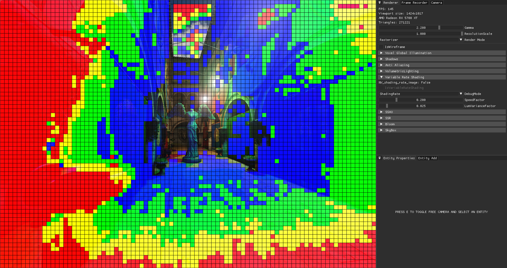

Red stands for 1 invocation per 4x4 pixels which means 16x less fragment shader invocations in those regions.
No color is the default - 1 invocation per pixel.

### 2.0 Shading Rate Image generation

The ultimate goal of the algorithm should be to apply a as low as possible shading rate without the user noticing. I assume the following are cases where we can safely reduce the shading rate:

* High average magnitude of velocity
* Low variance of luminance

This makes sense as you can generally see less detail in fast moving things. And if the luminance is roughly the same across a tile (which is what the variance tells you) there is not much detail to begin with.

In both cases we need the average of some value over all 16x16 pixels.

Average is defined as:

$$\overline{x} = \sum_{i = 1}^{n} \frac{1}{n} \cdot x_{i}$$

Where $\overline{x}$ is the average of $x$ and $n$ the number of elements.

For starters you could call `atomicAdd(SharedMem, value * (1.0 / n))` on shared memory, but atomics on floats is not a core feature and, as far as my testing goes, the following approach was no slower:
```glsl
#define TILE_SIZE 16
layout(local_size_x = TILE_SIZE, local_size_y = TILE_SIZE, local_size_z = 1) in;

const uint SAMPLES_PER_TILE = TILE_SIZE * TILE_SIZE;

shared float SharedSum[SAMPLES_PER_TILE];

void main() {
    SharedSum[gl_LocalInvocationIndex] = GetSpeed();

    for (int cutoff = SAMPLES_PER_TILE / 2; cutoff > 0; cutoff /= 2) {
        if (gl_LocalInvocationIndex < cutoff) {
            SharedSum[gl_LocalInvocationIndex] += SharedSum[cutoff + gl_LocalInvocationIndex];
        }
        barrier();
    }
    float average = SharedSum[0] / SAMPLES_PER_TILE;
}
```
This algorithm first loads all the values we want to average into shared memory.
Then it adds the first half of array entries to the other half, storing results in the first half. After that, all the new values are again split and added together. The output is now 1/4 the size of the original array. After `log2(16x16)` steps the final sum is collapsed into the first element.

That's it for the averaging part.

Calculating the variance requires a little more work.
What we actually want is the [Coefficient of variation](https://en.wikipedia.org/wiki/Coefficient_of_variation) (CV), because that is normalized and independent of scale (e.g {5, 10} and {10, 20} have same CV = ~0.33). But the two are related - variance is needed to compute CV.

The CV equals standard deviation divided by the average. And standard deviation is just the square root of variance.

$$V(x) = \frac{\sum_{i = 1}^{n}(x_{i} - \overline{x})^{2}}{n}$$

<!-- fix error of proceeding formula not rendering properly -->
&nbsp;

$$StdDev(x) = \sqrt{V(x)}$$

<!-- fix error of proceeding formula not rendering properly -->
&nbsp;

$$CV = \frac{StdDev(x)}{\overline{x}}$$


Directly translating this math into a program would require two passes. One to get the average and a second to get variance, however [there is a simpler way](https://blog.demofox.org/2020/03/10/how-do-i-calculate-variance-in-1-pass/):

$$V(x) = \overline{x^{2}} - \overline{x}^{2}$$

Variance equals average of luminance-squared minus luminance average squared. Here is an implementation. I put the parallel adding stuff from above in the function `ParallelSum`.
```glsl
#define TILE_SIZE 16
layout(local_size_x = TILE_SIZE, local_size_y = TILE_SIZE, local_size_z = 1) in;

const uint SAMPLES_PER_TILE = TILE_SIZE * TILE_SIZE;

void main() {
    float pixelLuminance = GetLuminance();

    float luminanceSum = ParallelSum(pixelLuminance);
    float luminanceSquaredSum = ParallelSum(pixelLuminance * pixelLuminance);

    if (gl_LocalInvocationIndex == 0) {
        float luminanceAvg = luminanceSum / SAMPLES_PER_TILE;
        float luminanceSquaredAvg = luminanceSquaredSum / SAMPLES_PER_TILE;

        float variance = luminanceSquaredAvg - luminanceAvg * luminanceAvg;
        float stdDev = sqrt(variance);
        float coeffOfVariation = stdDev / luminanceAvg;

        // use coeffOfVariation as a measure of "how different are the luminance values to each other"
    }
}
```

At this point, you can use both the average speed and the coefficient of variation of the luminance to get an appropriate shading rate. That is not the most interesting part.
I decided to scale both of these factors, add them together and then use that to mix between different rates.

### 3.0 Subgroup optimizations

While operating on shared memory is fast, Subgroup Intrinsics are faster.
They are a relatively new topic on it's own and you almost never see them mentioned in the context of OpenGL. The subgroup is an implementation dependent set of invocations in which data can be shared efficiently. There are many subgroup operations. The whole thing is document [here](https://github.com/KhronosGroup/GLSL/blob/master/extensions/khr/GL_KHR_shader_subgroup.txt), but vendor specific/arb extensions with `ARB_shader_group_vote` actually being part of core also exist.
Anyway, the one that is particularly interesting for our case of computing a sum is `KHR_shader_subgroup_arithmetic`, or more specifically the `subgroupAdd` function.

On my GPU a subgroup is 32 invocations big.
When I call `subgroupAdd(2)` the function will return 64.
So it does a sum over all values passed to the function in the scope of all (active) subgroup invocations.

Using this knowledge, an optimized version of a workgroup wide sum could look like this:
```glsl
#extension GL_KHR_shader_subgroup_arithmetic : require

layout(local_size_x = 256, local_size_y = 1, local_size_z = 1) in;

shared float SharedSums[gl_WorkGroupSize.x / SUBGROUP_SIZE];

void main() {
    float subgroupSum = subgroupAdd(GetValueToAdd());

    // Single invocation of each subgroup writes it's result
    // into shared mem for further workgroup wide processing
    if (subgroupElect()) {
        SharedSums[gl_SubgroupID] = subgroupSum;
    }
    barrier();

    // Let one invocation compute final workgroup wide result
    if (gl_LocalInvocationIndex == 0)
    {
        for (int i = 1; i < gl_NumSubgroups; i++)
        {
            SharedSums[0] += SharedSums[i];
        }
    }
    barrier();

    // final sum is stored in SharedSums[0]
}
```
Note how the workgroup expands the size of a subgroup, so we still have to use shared memory to obtain a workgroup wide result.
However there are only `gl_WorkGroupSize.x / gl_SubgroupSize = 256 / 32 = 8` remaining elements. These can simply be handled by a single invocation. This is a common pattern, an implementation of a reduction, which occurs in parallel GPU algorithms. 

## Point Shadows

### 1.0 Rendering

In core OpenGL, geometry shaders are the only stage where you can write to `gl_Layer`. This variable specifies which layer of the framebuffer attachment to render to.
There is a common approach to point shadow rendering where instead of: 
```cs
for (int face = 0; face < 6; face++) {
    NamedFramebufferTextureLayer(fbo, attachment, cubemap, level, face);
    // Render Scene into <face>th face of cubemap
    RenderScene();
}
```
you do:
```cs
RenderScene();
```
```glsl
void main() {
    for (int face = 0; face < 6; face++) {
        gl_Layer = face;
        OutputTriangle();
    }
}
```
Notice how instead of calling `NamedFramebufferTextureLayer` from the CPU we set `gl_Layer` inside a geometry shader saving us 5 draw calls and driver overhead.

So this should be faster right? - No. Geometry shaders are known to have a huge performance penalty on both AMD and NVIDIA. I don't have any measurements now, but I implemented both and simply doing 6 draw calls was way faster than the geometry shader method on RX 5700 XT. However we can do better. There are multiple extensions which allow you to set `gl_Layer` from the vertex shader!
[`ARB_shader_viewport_layer_array`](https://registry.khronos.org/OpenGL/extensions/ARB/ARB_shader_viewport_layer_array.txt) for example reads:
> In order to use any viewport or attachment layer other than zero, a
> geometry shader must be present. **Geometry shaders introduce processing
> overhead and potential performance issues**. The AMD_vertex_shader_layer
> and AMD_vertex_shader_viewport_index extensions allowed the **gl_Layer**
> and gl_ViewportIndex outputs to be written directly from the vertex shader
> with no geometry shader present.
> This extension effectively merges ...

Using any of these extensions, the way you do single-draw-call point shadow rendering might look like this:
```cs
RenderSceneInstanced(count: 6);
```

```glsl
#extension GL_ARB_shader_viewport_layer_array : enable
#extension GL_AMD_vertex_shader_layer : enable
#extension GL_NV_viewport_array2 : enable
#define HAS_VERTEX_LAYERED_RENDERING (GL_ARB_shader_viewport_layer_array || GL_AMD_vertex_shader_layer || GL_NV_viewport_array2)

void main() {
#if HAS_VERTEX_LAYERED_RENDERING
    gl_Layer = gl_InstanceID;
    gl_Position = PointShadow.FaceMatrices[gl_Layer] * Positon;
#else
    // fallback
#endif
}
```
Since vertex shaders can't generate vertices like geometry shaders, instanced rendering is used to tell OpenGL to render every vertex 6 times (once for each face). Inside the shader we can then use `gl_InstanceID` as the face to render to.
It gets a bit more complicated when you also support actual instancing or culling, but the idea stays the same.

### 2.0 Sampling

Just want to mention that OpenGL provides useful shadow sampler types like `samplerCubeShadow` or `sampler2DShadow`.
When using shadow samplers, texture lookup functions accept an additional parameter with which the depth value in the texture
is compared. The returned value is no longer the depth value, but instead a visibility ratio in the range of [0, 1].
When using linear filtering the comparison is evaluated and averaged for a 2x2 block of pixels.
And all that in one function!

To configure a texture such that it can be sampled by a shadow sampler, you can do this:
```cs
GL.TextureParameter(texture, TextureParameterName.TextureCompareMode, (int)TextureCompareMode.CompareRefToTexture);
GL.TextureParameter(texture, TextureParameterName.TextureCompareFunc, (int)All.Less);
```
And sample it in glsl like that:
```glsl
layout(binding = 0) uniform samplerCubeShadow ShadowTexture;

void main() {
    float fragDepth = GetDepthRange0_1(); 
    float visibility = texture(ShadowTexture, vec4(coords, fragDepth));
}
```

Here is a comparison of using shadow samplers (right) vs not using them:
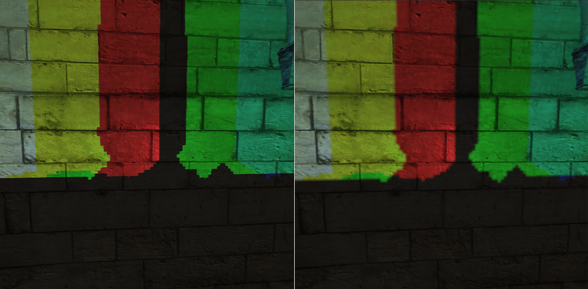

Of course, you can combine this with software filtering like PCF to get even better results.

## GPU Driven Rendering

### 1.0 Multi Draw Indirect

All Multi Draw Indirects internally just call another non multi draw command `drawcount` times.
In the case of `MultiDrawElementsIndirect` this underyling draw call is `DrawElementsInstancedBaseVertexBaseInstance`.
This effectively allows multiple meshes to be drawn with one API call, reducing driver overhead.

Arguments for these underlying draw calls are provided by us and expected to have the following format:
```cs
struct DrawElementsCmd
{
    int Count; // indices count
    int InstanceCount; // number of instances
    int FirstIndex; // offset in indices array
    int BaseVertex; // offset in vertex array
    int BaseInstance; // sets the value of `gl_BaseInstance`. Only used by the API when doing old school instancing
}
```
The `DrawCommand`s are not supplied through the draw function itself as usual, but have to be put into a buffer (hence "Indirect" suffix) which is then bound
to `GL_DRAW_INDIRECT_BUFFER` before drawing.
So to render 5 meshes you'd have to configure 5 `DrawCommand` and load them into the said buffer.

The final draw could then be as simple as:
```cs
public void Draw()
{
    GL.BindVertexArray(vao); // contains merged vertex and indices array + vertex format
    GL.BindBuffer(BufferTarget.DrawIndirectBuffer, drawCommandBuffer); // contains DrawCommand[Meshes.Length]

    GL.MultiDrawElementsIndirect(PrimitiveType.Triangles, DrawElementsType.UnsignedInt, null, Meshes.Length, 0);
}
```
While this renders all geometry just fine, you might be wondering how to access the entirety of materials to compute proper shading. After all scenes like Sponza come with a lot of textures and the usual method of manually declaring `sampler2D` in glsl quickly becomes insufficient as we can't do state changes between draw calls anymore (which is good) to swap out materials. This is where Bindless Textures comes in.

### 2.0 Bindless Textures

First of all [`ARB_bindless_texture`](https://registry.khronos.org/OpenGL/extensions/ARB/ARB_bindless_texture.txt) is not a core extension. Nevertheless, almost all AMD and NVIDIA GPUs implement it, as you can see [here](https://opengl.gpuinfo.org/listreports.php?extension=GL_ARB_bindless_texture). Unfortunately RenderDoc doesn't support it.

The main idea behind Bindless Textures is the ability to generate a unique 64 bit handle from any texture, which can then be used to uniquely identify it inside GLSL. This means that you no longer have to call `BindTextureUnit` (or the older `ActiveTexture` + `BindTexture`) to bind a texture to a texture unit.
Instead, generate the handle and somehow communicate it to the GPU in what ever way you like (commonly through a SSBO).

Example:
```cs
ulong handle = GL.Arb.GetTextureHandle(texture);
GL.Arb.MakeTextureHandleResident(handle);

GL.CreateBuffers(1, out int buffer);
GL.NamedBufferStorage(buffer, sizeof(ulong), handle, BufferStorageFlags.DynamicStorageBit);
GL.BindBufferBase(BufferRangeTarget.ShaderStorageBuffer, 0, buffer);
```
```glsl
#version 460 core
#extension GL_ARB_bindless_texture : require

layout(std430, binding = 0) restrict readonly buffer TextureSSBO {
    sampler2D Textures[];
} textureSSBO;

void main() {
    sampler2D myTexture = textureSSBO.Textures[0];
    vec4 color = texture(myTexture, coords);
}
```
Here we generate a handle, upload it into a buffer and then access it through a shader storage block which exposes the buffer to the shader.
After the handle is generated, the texture's state is immutable. This cannot be undone.
To sample a bindless texture it's handle must also be made resident.
The extension allows you to place `sampler2D` directly inside the shader storage block as shown. Note however that you could also do `uvec2 Textures[];` and then perform a cast like: `sampler2D myTexture = sampler2D(textureSSBO.Textures[0])`.

In the case of an MDI renderer as described in [1.0 Multi Draw Indirect](#10-multi-draw-indirect).
the process of fetching each mesh's texture would look something like this:
```glsl
#version 460 core
#extension GL_ARB_bindless_texture : require

layout(std430, binding = 0) restrict readonly buffer MaterialSSBO {
    Material Materials[];
} materialSSBO;

layout(std430, binding = 1) restrict readonly buffer MeshSSBO {
    Mesh Meshes[];
} meshSSBO;

void main() {
    Mesh mesh = meshSSBO.Meshes[gl_DrawID];
    Material material = materialSSBO.Materials[mesh.MaterialIndex];

    vec4 albedo = texture(material.Albedo, coords);
}
```
`gl_DrawID` is in the range of [0, drawcount - 1] and identifies the current sub draw inside a multi draw. And each sub draw corresponds to a mesh.
`Material` is just a struct containing one or more bindless textures.

There is one caveat (not exclusive to bindless textures), which is that they must be indexed with a [dynamically uniform expression](https://www.khronos.org/opengl/wiki/Core_Language_(GLSL)#Dynamically_uniform_expression). Fortunately `gl_DrawID` is defined to satisfy this requirement.

### 3.0 Frustum Culling

Frustum culling is the process of identifying objects outside a camera frustum and then avoiding unnecessary computations for them.
The following implementation fits perfectly into the whole GPU driven rendering thing.

The ingredients needed to get started are:
- A projection + view matrix
- Buffer containing each mesh's model matrix
- Buffer containing each mesh's draw command
- Buffer containing each mesh's bounding box

In an MDI renderer as described in [1.0 Multi Draw Indirect](#10-multi-draw-indirect), the first three points are required anyway.
And getting a local space bounding box from each mesh's vertices shouldn't be a problem.

Remember how `MultiDrawElementsIndirect` reads draw commands from a buffer object?
That means the GPU can modify it's own drawing parameters by writing into this buffer object (using shader storage blocks).
And that's the key to GPU accelerated frustum culling without any CPU readback.

Basically, the CPU side of things is as simple this:
```cs
void Render()
{
    // Frustum Culling
    GL.UseProgram(frustumCullingProgram);
    GL.DispatchCompute((Meshes.Length + 64 - 1) / 64, 1, 1);
    GL.MemoryBarrier(MemoryBarrierFlags.CommandBarrierBit);

    // Drawing
    GL.BindVertexArray(vao);
    GL.UseProgram(drawingProgram);
    GL.BindBuffer(BufferTarget.DrawIndirectBuffer, drawCommandBuffer);
    GL.MultiDrawElementsIndirect(PrimitiveType.Triangles, DrawElementsType.UnsignedInt, null, Meshes.Length, 0);
}
```
A compute shader is dispatched to do the culling and adjust the content of `drawCommandBuffer` accordingly.
The memory barrier ensures that at the point where `MultiDrawElementsIndirect` reads from `drawCommandBuffer` all previous
incoherent writes into to that buffer are visible.

Let's get to the culling shader:
```glsl
#version 460 core
layout(local_size_x = 64, local_size_y = 1, local_size_z = 1) in;

struct DrawElementsCmd {
    uint Count;
    uint InstanceCount;
    uint FirstIndex;
    uint BaseVertex;
    uint BaseInstance;
};

layout(std430, binding = 0) restrict writeonly buffer DrawCommandsSSBO {
    DrawCommand DrawCommands[];
} drawCommandSSBO;

void main() {
    uint meshIndex = gl_GlobalInvocationID.x;
    if (meshIndex >= meshSSBO.Meshes.length())
        return;

    Mesh mesh = meshSSBO.Meshes[meshIndex];
    Box box = mesh.AABB;
        
    Frustum frustum = GetFrustum(ProjView * mesh.ModelMatrix);
    bool isMeshInFrustum = FrustumBoxIntersect(frustum, box.Min, box.Max);

    drawCommandSSBO.DrawCommands[meshIndex].InstanceCount = isMeshInFrustum ? 1 : 0;
}
```

Each thread grabs a mesh builds a frustum and then compares it against the aabb.
`drawCommandSSBO` stores the draw commands used by `MultiDrawElementsIndirect`.
If the test fails, `InstanceCount` is set to 0 otherwise 1.
A mesh with `InstanceCount = 0` will not cause any vertex shader invocations later when things are drawn, saving a lot of computations.
